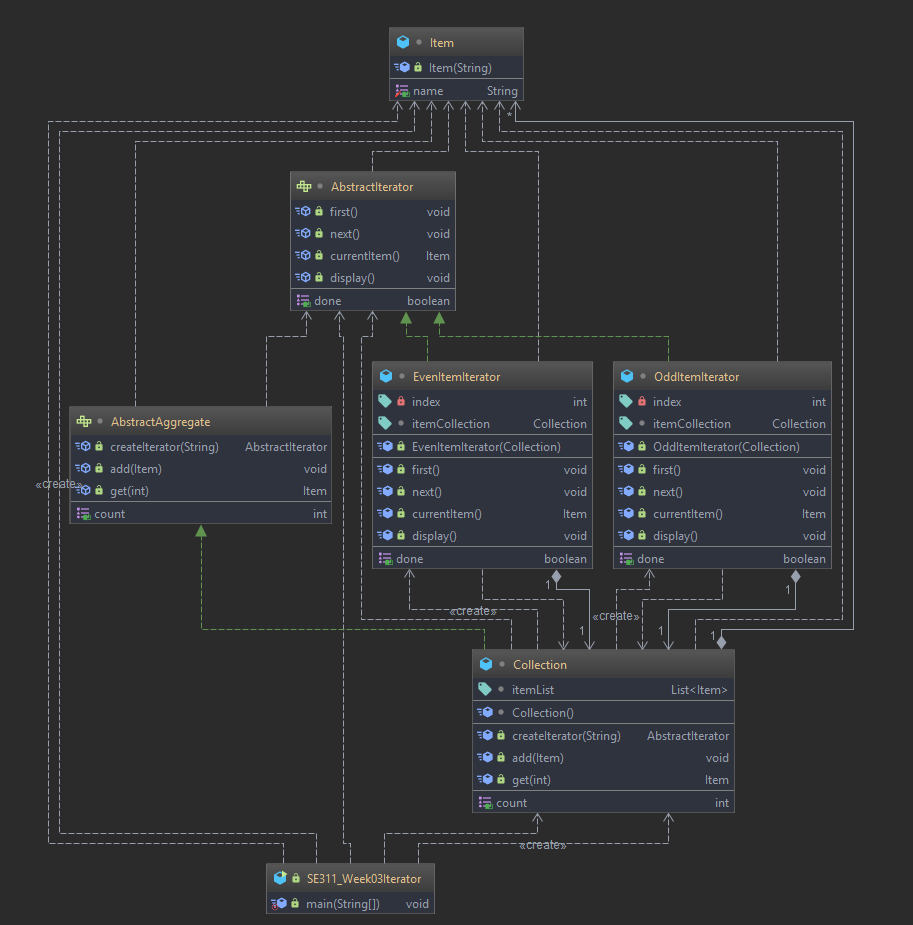
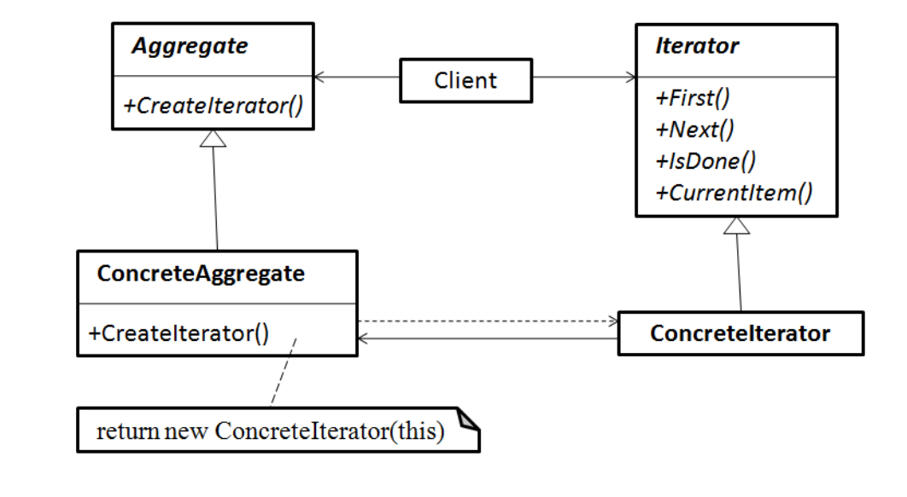

# Iterator Pattern(Cursor)

An aggregate object such as a list should allow a way to traverse its
elements without exposing its internal structure.

It should allow different traversal methods.
But, we really do not want to add all these methods to the interface
for the aggregate.
  
# Example 

# Intent

 *  Provide a way to access the elements of an aggregate object
    sequentially without exposing its underlying representation.
    
 *   An aggregate object is an object that contains other objects for the
    purpose of grouping those objects as a unit. It is also called a
    container or a collection. Examples are a linked list and a hash table
   
# Participants

* **Iterator**
Defines an interface for accessing and traversing elements.
* **ConcreteIterator**
Implements the Iterator interface.
Keeps track of the current position in the traversal.
* **Aggregate**
Defines an interface for creating an Iterator object (a factory method!)
* **ConcreteAggregate**
Implements the Iterator creation interface to return an instance of the
proper ConcreteIterator

# Structure

