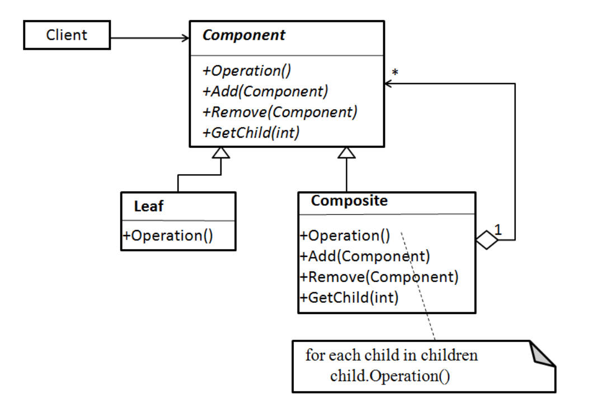

# Composite Pattern
    
  A composite object represents a composition of heterogeneous, possibly
  recursive, component objects.
  
  **Problem**: composite object consists of several heterogeneous parts
  Client code is complicated by knowledge of object structure.
  Client must change if data structure changes.
  
  **Solution**: create a uniform interface for the object’s components
  Interface advertises all operations that components offer.
  Client deals only with the new uniform interface.
  Uniform interface is the union of the components’ services
  
# Example 

Flutter widgets example with transparent version of the Composite pattern.

# Intent

 *  Compose objects into tree structures to represent part-whole
    hierarchies.
    
 *   Composite lets clients treat individual objects and compositions of
    objects uniformly. This is called recursive composition

# Participants

* **Component**
declares the interface for objects in the composition.
implements default behavior for the interface common to all classes, as
appropriate.
declares an interface for accessing and managing its child components.
* **Leaf**
represents leaf objects in the composition. A leaf has no children.
defines behavior for primitive objects in the composition.
* **Composite**
defines behavior for components having children.
stores child components.
implements child-related operations in the Component interface.
* **Client**
manipulates objects in the composition through the Component
interface.
# Structure

