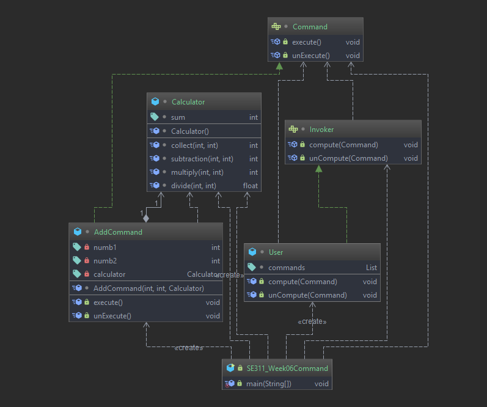
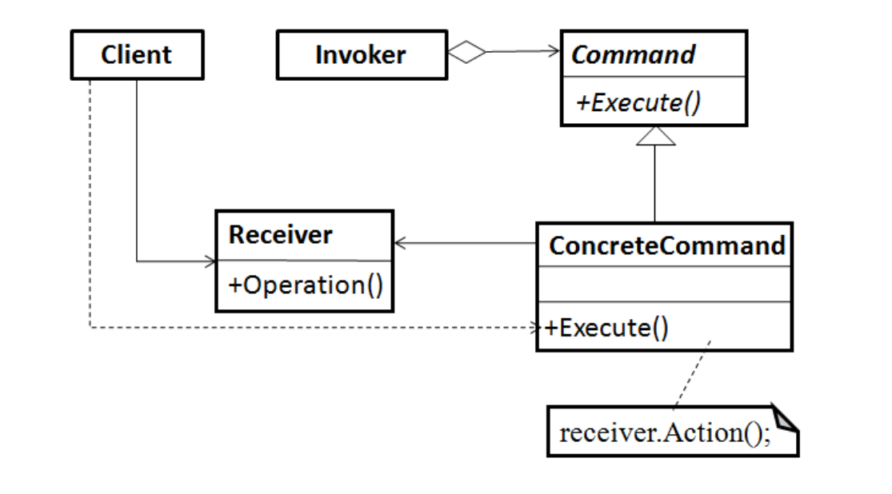

# Command Pattern
    
  an object oriented callback,
  Using command as a object gives you lots of opportunities, 
  you can declare macro command or support undoable operations
  
# Example 

# Intent

 *  Encapsulate a request as an object, thereby letting you manipulate the
    requests in various ways, queue or log requests, support undoable
    operations.

# Participants

* **Command**:
    Declares an interface for executing an operation.
    
* **ConcreteCommand**:
    Defines a biding between a Receiver object and an action
    
* **Client**:
    creates a ConcreteCommand object and sets its receiver
  
* **Invoker**
  Asks the command to carry out the request
  
* **Receiver**
  Knows how to perform the operations associated with 
  carrying out a request, anc class may serve as a Receiver

# Structure

