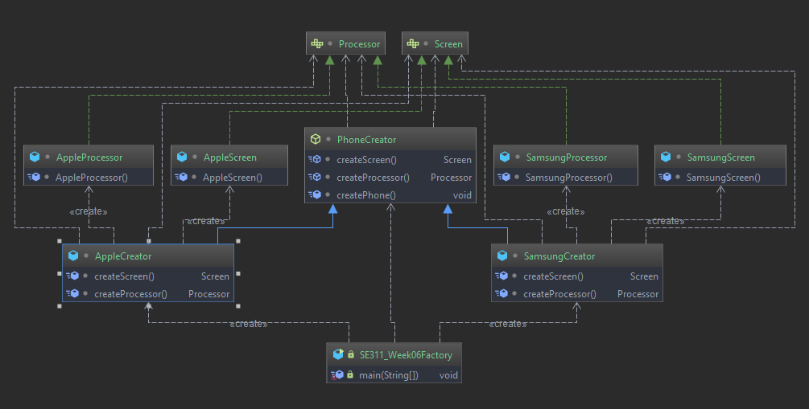
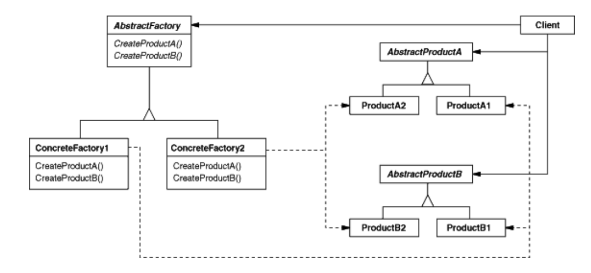

# Abstract Factory Method

Factory patterns are examples of creational patterns.
Class creational patterns focus on the use of inheritance to decide the
object to be instantiated.
# Example 

# Intent

 *  Provide an interface for creating families of related or dependent
    objects without specifying their concrete classes.
 * The Abstract Factory pattern is very similar to the Factory Method
      pattern.One difference between the two is that with the Abstract
      Factory pattern, a class delegates the responsibility of object
      instantiation to another object via composition whereas the Factory
      Method pattern uses inheritance and relies on a subclass to handle the
      desired object instantiation
 * Actually, the delegated object frequently uses factory methods to
   perform the instantiation!

# Participants

* **AbstractFactory**:
    Declares an interface for operations that create abstract product objects
    
* **ConcreteFactory**:
    Implements the operations to create concrete product objects Implements the product interfcae
    
* **AbstractProduct**:
    Declares an interface for a type of product object
  
* **ConcreteCreator**
  Defines a product object to be created by the corresponding concrete factor
  
  Implements the AbstractProduct interface
* **Client**
  Uses only interface declared by abstractFactory and AbstractProduct classes

# Structure

