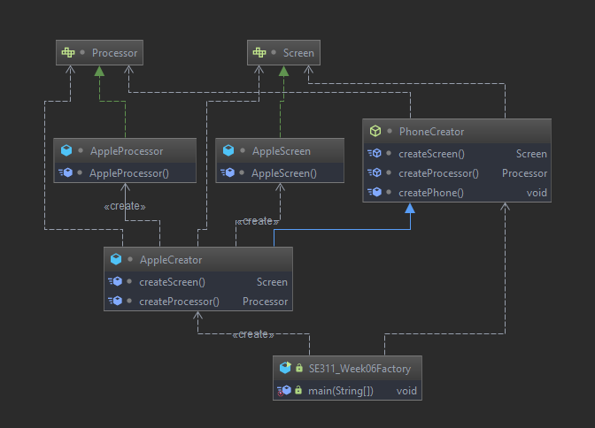
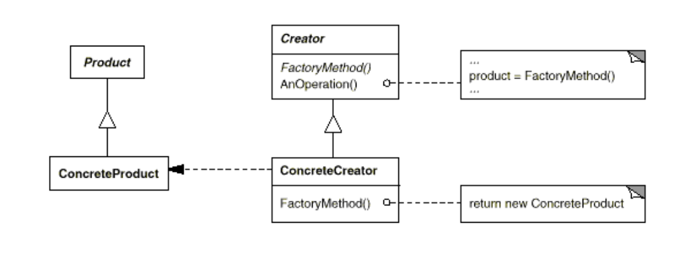

# Factory Method

Factory patterns are examples of creational patterns.
Class creational patterns focus on the use of inheritance to decide the
object to be instantiated.
# Example 

# Intent

 *  Define an interface for creating an object, but let subclasses decide
    which class to instantiate

# Participants

* **Product**:
    Defines the interface for the type of objects the factory method creates
    
* **ConcreteProduct**:
    Implements the product interface
    
* **Creator**:
    Declares the factory method which returns an object of type Product
  
* **ConcreteCreator**
  Overrides the factory method to return an instance of a ConcreteProduct

# Structure

