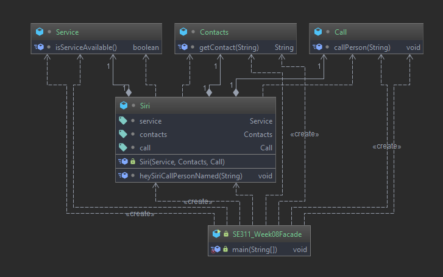
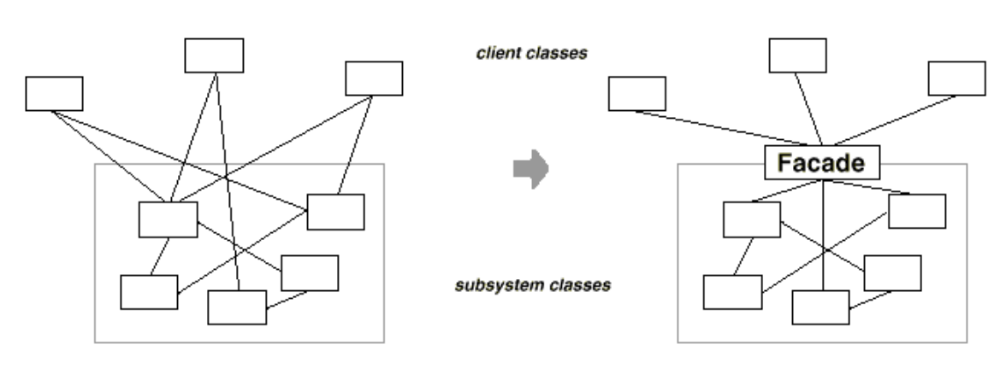
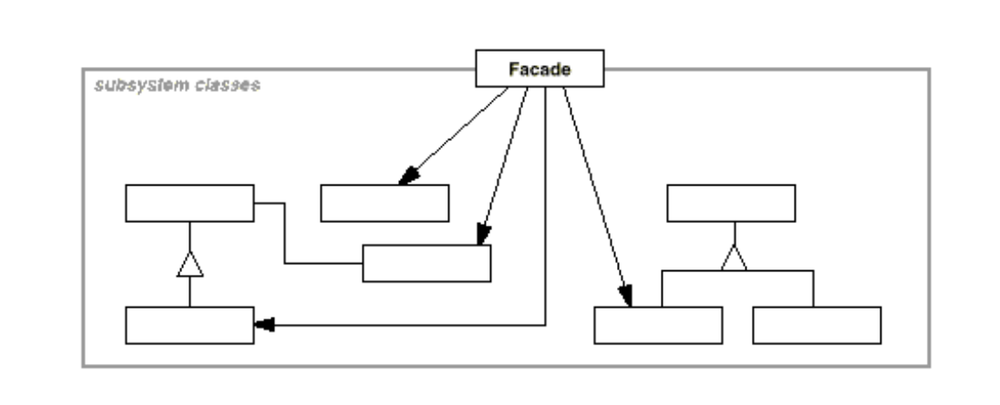

# Facade Pattern 

# Example 

# Intent

 *  Provide a unified interface to a set of interfaces in a subsystem.
 
 * Facade defines higher-level interface 
that makes the subsystem easier to use, 
but the client still has access to subsystem.  
# Problem

* Structuring a system into subsystems helps reduce complexity.

* Subsystems are groups of classes, or groups of classes and other
  subsystems.

* One way to reduce this complexity is to introduce a facade object that
  provides a single, simplified interface to the more general facilities of a
  subsystem.

# Participants

* **Facade**:
  Knows which subsystem classes are responsible for a request.
  Delegates the client requests to appropriate subsystem objects.
  
* **Subsystem classes**
  Implement subsystem functionality.
  Handle work assigned by the facade object.
  Have no knowledge of the facade; that is they keep no references to it.

# Structure

