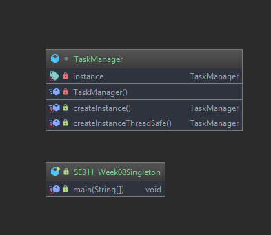
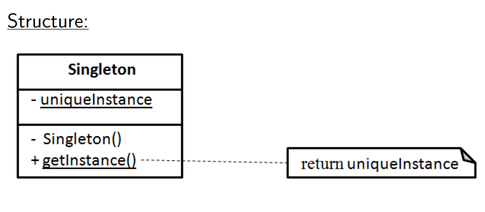

# Singleton Pattern 

# Example 

# Intent

 *  Ensure a class only has one instance, and provide a global point of
    access to it.
 
# Problem

*  Sometimes we want just a single instance of a class to exist in the
   system.
 *  A GUI application must have a single mouse.
 *  An OS must have one window manager.
 *  An active modem needs one telephone line.
 *  PC is connected to one keyboard.
   
 *  We need to have that one instance easily accessible.
   And we want to ensure that additional instances of the class can not
   be created.
# Participants

* **Singleton**:
  defines a getInstance operation that lets clients access its unique
  instance. getInstance is a class operation.
  May be responsible for creating its own unique instance.

# Structure

