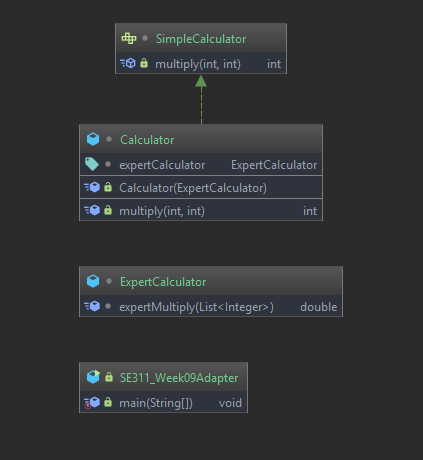
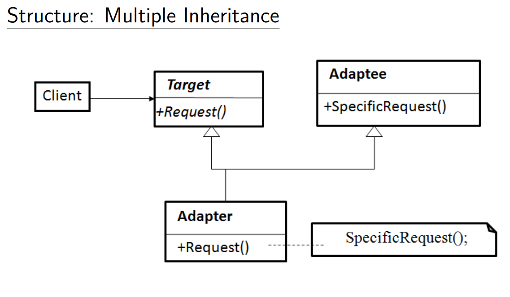
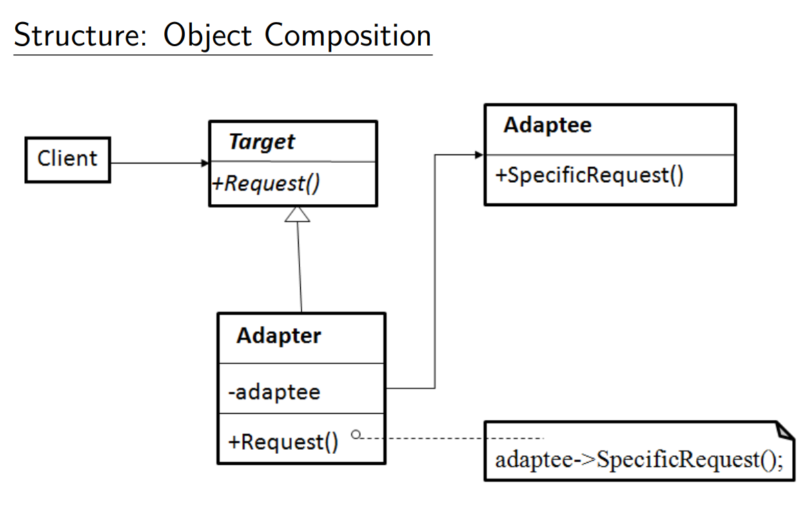

# Adapter Pattern (Wrapper)

# Example 

This example for creating game with GameEngines, the algorithm is same for creating a new project in game engines.

# Intent

 *  Convert the interface of a class into another interface clients expect.
 Adapter lets classes work together that could not otherwise because of incompatible interfaces.
 
# Problem

*  Sometimes a toolkit or class library can not be used because its
 interface is incompatible with the interface required by an application.
*  We can not change the library interface, since we may not have its
 source code.
 * Even if we did have the source code, we probably should not change
 the library for each domain-specific application
 
# Participants

* **Target**: 
Defines the domain-specific interface that Client uses
* **Adapter**:
Adapts the interface of Adaptee to the Target interface
* **Client**
Colloborates with objects conforming to the Target interface
* **Adaptee**:
Defines an existing interface that needs adapting

# Structure

