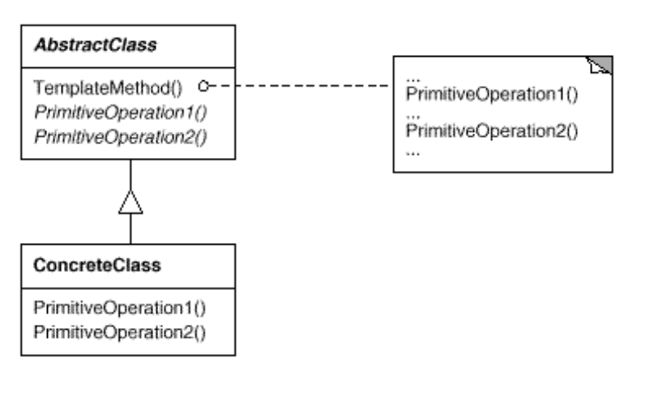

# Template Method

 Define a method in base-super class for an algorithm, and let sub-classes redefine sub-steps.
 It is just an method, that performs with the same structure & order & algorithm.

# Example 

This example for creating game with GameEngines, the algorithm is same for creating a new project in game engines.

# Intent

 *  Define the skeleton of an algorithm in an operation, deferring some
    steps to subclasses. Template Method lets subclasses redefine certain
    steps of an algorithm without changing the algorithm’s structure.

# Problem

 Sometimes you want to specify the order of operations that a method
 uses, but allow subclasses to provide their own implementations of
 some of these operations.

# Structure

