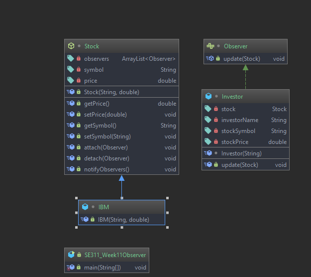
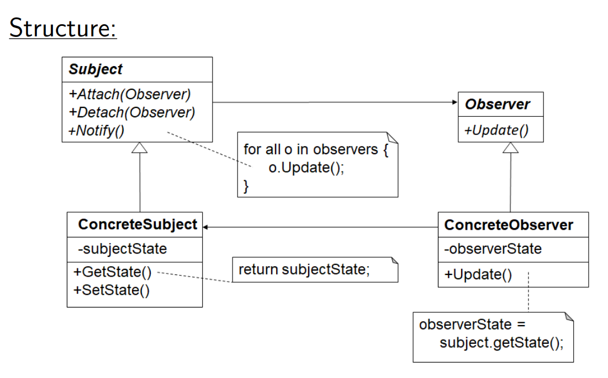

# Observer Pattern

# Example 

 This example about stock's, when stock price change it observers should notify. 
 In this example 
 * Stock is our Subject(AbstractSubject)
 * IBM is ConcreteSubject
 * Observer is AbstractObserver(interface for observables)
 * Investor is ConcreteObserver

# Intent

 *  Define a one-to-many dependency between objects so that 
 when one object change the state, all its dependents are notified and updated automatically.

# Problem

 A large monolithic design does not scale well as new graphing or monitoring requirements are levied.
 

# Participants

 **Subject** : 
 * Keeps track of its observers (attach,detach)
 * Defines an interface for notify its observers.
 
 **Observer** : Defines an interface for update notification.
 
 **ConcreteSubject** :
 * The object being observed
 * Stores state of interest to ConcreteObserver objects
 * Sends a notification to its observers when state change
 
 **ConcreteObserver** : 
 * The observing object
 * Stores state that should stay consistent with the subject’s.
 * Implements the Observer update interface to keep its state consistent
 with the subject’s

# Structure

