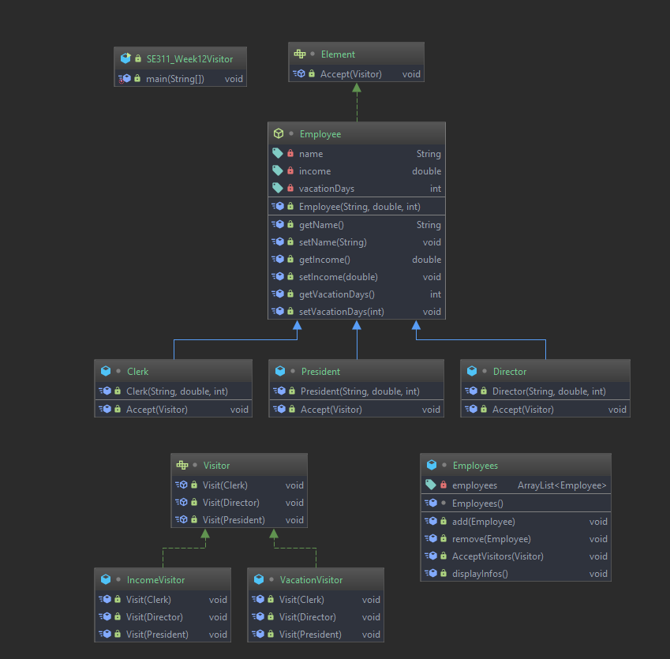
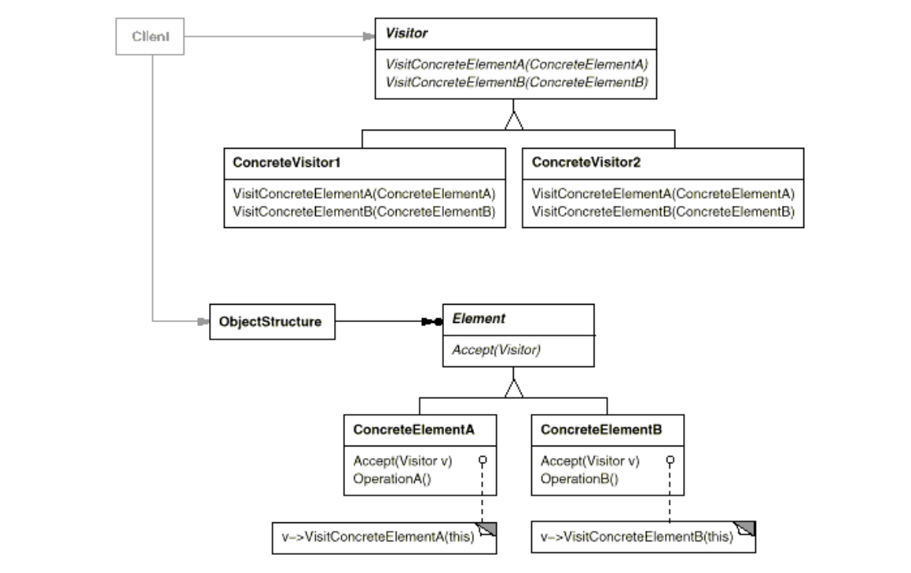

# Visitor Pattern

# Example 

 This example for increasing the employees income and vacation days, 
 To increase Employee income and vacation days we don't want to change 
 class representation so that we use **Visitor** pattern, 
 Firstly, We create **IncomeVisitor** for **changing the income of the employee** 
 and **VacationVisitor** for **manipulating the vacation days of the employee**

# Intent

 *  The visitor pattern let you define a new operation for a class/object without
 changing the classes representation.
 *  Do the right thing based on the type of the objects.
 *  Double dispatch

# Problem

 Sometimes you need to add new operations to (interface)node objects but 
 it needs to know each sub type to performs the operation different in 
 each object&sub-classes.
 
 Many distinct and unrelated operations would need to be performed on node objects/classes
 in a heterogeneous aggregate structure. You dont want to have to query  the type of 
 each node and cast the pointer to correct type before performing the desired operation.
 

# Participants

 **Visitor** : Defins a Visit operation for each class 
 of **ConcreteElement** in the object structure.
 
 **ConcreteVisitor** : Implements each operation declared by the **Visitor**
 
 **Element** : Defines an accept operation that takes visitor as an argument.
 
 **ConcreteElement** : Implements an accept operation that takes **Visitor** as an argument.
 
 **ObjectStructure** : Can enumerate its elements.
                       May provide a high-level interface to allow the visitor to visit its
                       elements.
                       May either be a composite or a collection such as a list or set.

# Structure

